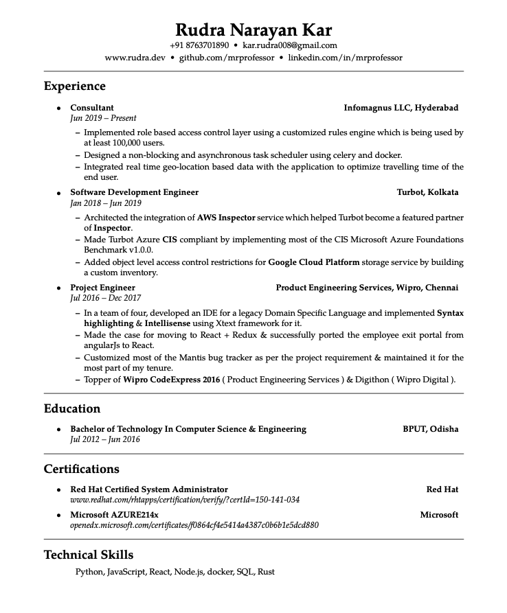

# simpleCV
Finally a 1980's themed simple resume.

- Compile it with pdfLatex. If you are using fontspec(Which I have commented out currently) use XeLatex.
- Heavily inspired/copied from Dan McGee's [blog](https://www.toofishes.net/blog/why-i-do-my-resume-latex/)

###### ScreenShot

<kbd>
    
</kbd>
